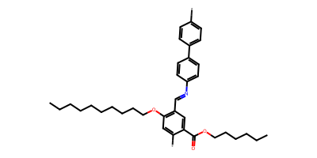
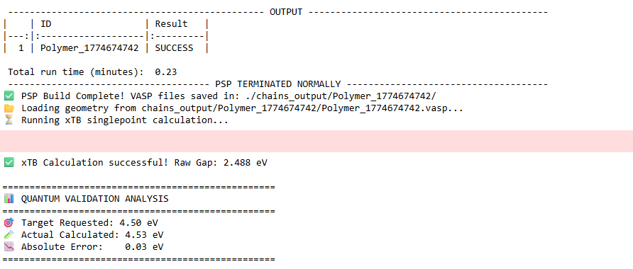

# Conditional Discrete Diffusion Language Model for Polymer Discovery

This repository contains the core generative modeling pipeline for property-conditioned polymer discovery, leveraging a Conditional Discrete Diffusion Language Model (CDDLM) built on a modern transformer encoder backbone.

## Overview
Unlike traditional autoregressive sequence models, this implementation frames molecular generation as a non-autoregressive, iterative denoising process. The model learns to recover clean polymer SMILES structures from completely corrupted (masked) sequences, explicitly guided by continuous physical property constraints.

* Generative Backbone: Utilizes answerdotai/ModernBERT-base as a bidirectional transformer encoder to capture dense, long-range contextual sequence representations across complex macromolecular architectures.
* Property Conditioning: Implements a continuous GaussianFourierProjection embedding module that maps scalar property constraints—such as target electronic band gap (E_g)—into a high-dimensional frequency space to drive the reverse diffusion trajectory.
* Sampling Strategy: Incorporates Classifier-Free Guidance (CFG) during the reverse denoising process, enabling precise control over the trade-off between target property adherence and sequence diversity.
* Validation Pipeline: Features an integrated evaluation suite calculating standard structural metrics (Validity, Uniqueness, Novelty) alongside real-time quantum-chemical verification via a live GFN2-xTB calculator.

---

## Finetune Results

---

## Repository Structure

* model.py — Core CDDLM architecture and GaussianFourierProjection embedding layers.
* tokenizer.py — Vocabulary mappings and regex-based tokenization optimized for handling complex polymer branching and wildcards (* / [*]).
* training.py — Main unconditioned/conditioned pre-training script utilizing the PI1M_v2.csv dataset.
* finetune_training.py — Fine-tuning pipeline built for strict conditioning on explicit electronic properties via Egc.csv.
* evaluate_metrics.py — Standardized validation matrix computing internal metrics alongside external quantum-chemical property adherence via the live xTB calculator.
* finetune_inference.ipynb — Interactive workspace for checkpoint evaluation, diverse sample stream generation, and property verification.
* train.sh — Pre-training execution script.
* finetune.sh — Fine-tuning execution script.

---

## Getting Started

### 1. Data Requirements
The pipeline expects paths to two primary data tracking files:
* `PI1M_v2.csv`: Large-scale polymer database used for capturing structural syntax and baseline synthetic accessibility profiles.
* `Egc.csv`: Target dataset containing explicit SMILES mappings to calculated electronic band gap (E_g) values.

### 2. Execution
To run baseline pre-training:
python training.py (or run: bash train.sh)

To execute property-conditioned fine-tuning for targeted electronic profiles:
python finetune_training.py (or run: bash finetune.sh)

---

## Research Attribution
This codebase is a component of ongoing graduate research at the Georgia Institute of Technology (School of Materials Science & Engineering).

Copyright & Licensing
© 2026 Vansh Suresh Yadav. All rights reserved.
This code is intended exclusively for private research evaluation. Copying, distributing, or modifying these files without explicit authorization is strictly prohibited.
